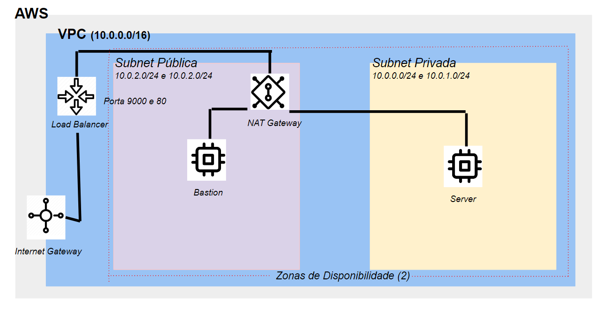

# Sprint 2 - Programa de Bolsas Compass UOL / AWS e Univesp

Avaliação da segunda sprint do programa de bolsas Compass UOL para formação em machine learning para AWS.

***

## Links do projeto

[Porta: 80](alb-sprint2-grupo5-1634502499.us-east-1.elb.amazonaws.com)

[Porta: 9000](alb-sprint2-grupo5-1634502499.us-east-1.elb.amazonaws.com:9000)


## Equipe
- Adila Mota
- Irati Gonçalves Maffra
- Márcio Lima Brunelli
***

## Objetivo
Exposição na web do projeto da Sprint 1 (**Sistema para validação de Dados de Cadastro**), com a utilização da AWS Cloud.
***
## Pré-requisito
Familiarização com conceitos básicos de rede, além de possuir uma conta AWS e acesso ao console AWS.
***
## Execução
A rede privada foi criada dentro da plataforma da AWS

**Especificações**:

1. Criação de uma VPC.
-   No console AWS, abra o serviço de VPC
-   Selecione o botão "Criar VPC"
-   Defina o nome da VPC, o bloco de endereços de IP e as configurações do DNS
-   Aguarde confirmação
-   Divida o bloco de endereço de IP utilizado na criação da VPC:
    -   Na a opção "Subnets" crie quatro Subnets: duas Subnets Privadas vinculadas à VPC, cada uma em um zona de disponibilidade e com bloco de IP diferentes; duas Subnets Públicas vinculadas à VPC criada, cada uma em zona de disponibilidade e com bloco de IP diferentes

2. Criação de um Internet Gateway, associada à VPC criada.
-   No serviço de VPC, seleciona a opção "Internet Gateway"
-   Selecione o botão "Criar Internet Gateway"
-   Com Internet Gateway criado selecionado clique em "Associar com VPC" e escolha a VPC criada anteriormente

3. Criação das rotas públicas e privadas.
-   No serviço de VPC, selecione "Rotas"
-   Selecione o botão "Criar rota" e escolha a tabela que será atualizada
-   Adicione uma rota para a rede pública, com o bloco de endereço IP 0.0.0.0/0 e selecione o Internet Gateway criado como destino
-   Adicione uma nova rota para a rede privada

4. Criação de um NAT Gateway para ligação da rota pública com um IP elástico.
-   No serviço de VPC, selecione "NAT Gateways"
-   Selecione o botão "Criar NAT Gateway" e escolha a VPC e a sub-rede pública
-   Selecione um Elastic IP para associar à NAT Gateway 
-   Aguarde a confirmação da criação

5. Conclusão da configuração da rota privada.
-   Na "Tabela de Rotas", selecione a rota privada e configure com o bloco de endereço IP 0.0.0.0/0
-   selecione o NAT Gateway como destino
   
6. Criação do Security Group com as regras entrada e saída.
-   No serviço de VPC, clique "Grupos de Segurança"
-   Crie um grupo de segurança público e vincule as seguintes configurações:
    -   Entrada: libere o acesso "SSH" ao seu próprio endereço de IP
    -   Saída: libere todo o tráfego ao endereço 0.0.0.0/0

7. Criação de uma instância t2.micro.
-   No serviço EC2 clique em executar instância
-   Escolha os nomes e tags, defina o sistema operacional
-   Em "Tipo de instância" selecione a opção "t2.micro"
-   Insira ou crie par de chaves
-   Edite a "Configurações de rede" à partir da sua VPC, escolha as subnets para instância
-   Atribua ou não IP público automaticamente
-   Em "grupo de segurança" escolha ou crie para a instância
-   Em "configuração de armazenamento" escolha a quantidade e tipo de volume para sua instância
-   Eexecute a instância e aguarde a sua disponibilidade

8. Instalação de um servidor nginx na instância.
-   Após configurar as máquinas, realize os comandos no terminal:
- Eleve seus privilégios
```
sudo su –
```
- Atualize o sistema
```
yum update -y
```
-Instale o nginx
```
sudo amazon-linux-extras install nginx1
```
-Navegue até a pasta de configuração do nginx
```
cd /etc/nginx
```
-Edite o arquivo nginx.config,
```
vim nginx.config
```
- Altere a seção server do arquivo (server, opção root: troque "/usr/share/nginx/html" por "/var/www/html/scr/")
- Salve e saia do arquivo
- IMPORTANTE: Repare, nesse arquivo, que você pode adicionar portas de "listeners" nessa máquina. A porta 9000 poderia ser aberta aqui. No entanto, não é necessário liberá-las nesse arquivo, já que o responsável por abrir o acesso a porta 9000 será o Load Balancer da AWS.
-Inicie o nginx
```
systemctl enable nginx –-now
```

- Após os comandos acima, a máquina estará pronta para upar sua aplicação na pasta destinada para root do nginx.

9. Mudança para a porta 9000 para acesso através do nginx.
-   Configure o “Elastic Load Balancer” no console
-   Acesse o painel EC2 e vá em “Balanceamento de carga”, na configuração:
    -   Escolha o esquema para sua aplicação
    -   No campo “Listeners” escolha a porta HTTP 9000
    -   Zona de disponibilidade, selecione as subnets criadas
    -   Crie um grupo de segurança para regras de entrada da porta 9000
    -   Na configuração roteamento selecione a porta 9000
    -   Registre o destino da instância para upar na web
    -   Confirme suas configurações e a Elastic Load Balancer será criada

10. Subida no servidor da aplicação da Sprint 1.
- Caso você não esteja rodando uma instância com o Amazon Linux, os comandos abaixo podem não funcionar.
- Copie sua chave (caso esteja usando uma chave ssh) da sua máquina local para o servidor acessado
```
scp "SuaChave.ssh" "SuaChave.ssh" seuUsuario@IPMaquinaPublica:/tmp
```
- Copie os arquivos de seu projeto para a mesma pasta para onde acabou de copiar sua chave de acesso:
```
scp "scr.zip" "scr.zip"  seuUsuario@IPMaquinaPublica:/tmp
```
- Acesse a máquina em rede pública (bastion) através do terminal. Você precisará do IP público fornecido para a máquina (essa informação está disponível no painel EC2 do console da AWS)
```
ssh "SuaChave.ssh" seuUsuario@IPMaquinaPublica
```
- Eleve seus privilégios.
```
sudo su -
```
- Navegue até a pasta /tmp
```
cd /tmp
```
- Proteja sua chave, concedendo apenas privilégios de leitura ao usuário root
```
chmod 400 "SuaChave.ssh"
```
- Copie seus arquivos de projeto para o servidor em rede privada.  Você precisará do IP privado fornecido para a máquina (essa informação está disponível no painel EC2 do console da AWS)
```
scp "scr" "scr.zip" seuUsuario@IPMaquinaPrivada:/tmp
```
- Acesse a máquina privada através da sua chave ssh:
```
ssh "SuaChave.ssh" seuUsuario@IPMaquinaPrivada
```
- Eleve seus privilégios
```
sudo su -
```
- Navegue até o diretório tmp
```
cd /tmp
```
- Copie os aquivos do seu projeto para a pasta de arquivos do nginx
```
install "scr" /var/www/html/scr/
```
- Navegue até a pasta para onde os arquivos foram enviados (/var/www/html/scr/)
```
cd /var/www/html/scr/
```
- Descompacte os arquivos
```
unzip "scr.zip"
```
- Mova o arquivo "scr.zip" para /home, para fins de histórico
```
mv "scr.zip" /home/usuario
```
- Altere o proprietário dos arquivos do diretório
```
chown nginx: * -R
```
- Cheque se todos os seus arquivos foram descompactados corretamente, e se o nginx é o proprietário de todos os arquivos e pastas
```
ls -lh
```
- Caso tudo tenha sido descompactado corretamente, reinicie o nginx
```
sudo service nginx restart
```
- Seu site está exposto à internet!


## Topologia proposta:


***


## Topologia realizada:




## Desenvolvimento

O projeto foi desenvolvido na plataforma da AWS seguindo roteiro proposto para a Sprint 2 e divisão de tarefas entre os membros da equipe (grupo-5). O código em JavaScript da Sprint 1 utilizado foi o do grupo-2.


